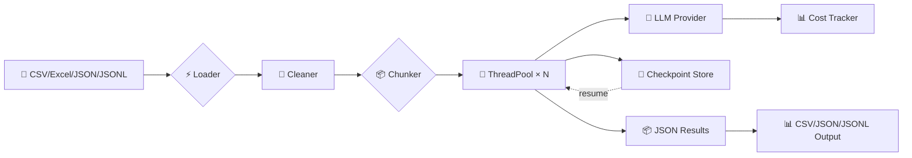

<!--
README.md — AI Semantic Analyzer
Built on the repo-artistry skill. LobeHub-style template, scrubbed of personal data.
-->

<div align="center">

# 🧠 AI Semantic Analyzer

**Industrial-grade LLM pipeline for CSV/Excel text analysis.**

Sentiment · Classification · Sarcasm detection · Lead scoring · Entity extraction — at scale.

[Quick Start](#-quick-start) · [Use Cases](#-use-cases) · [Architecture](#-architecture) · [Docs](docs/quickstart.md) · [Skill](skills/dataset-processor/SKILL.md)

[](https://github.com/Maatq1544/ai-semantic-analyzer/releases)
[](https://github.com/Maatq1544/ai-semantic-analyzer/actions)
[](https://github.com/Maatq1544/ai-semantic-analyzer/actions)
[](https://www.python.org)
[](LICENSE)

[](https://deepseek.com)
[](https://openai.com)
[](https://anthropic.com)
[](https://ollama.com)

**Share:** [X](https://x.com/intent/tweet?text=Check%20out%20AI%20Semantic%20Analyzer%20%E2%80%94%20industrial%20LLM%20pipeline%20for%20CSV%20analysis) · [LinkedIn](https://www.linkedin.com/sharing/share-offsite/?url=https%3A%2F%2Fgithub.com%2FMaatq1544%2Fai-semantic-analyzer) · [Reddit](https://www.reddit.com/submit?url=https%3A%2F%2Fgithub.com%2FMaatq1544%2Fai-semantic-analyzer&title=AI%20Semantic%20Analyzer)

</div>

---

## 🌪 The Problem

You've got **10,000 customer reviews**, survey responses, support tickets, or free-text leads. Spreadsheet chaos.

- **Manual review?** Takes weeks. Expensive. Biased.
- **Keyword search?** Misses sarcasm ("Great service... NOT"), context, and implicit intent.
- **Generic AI tools?** Hallucinate or fail to output structured data you can use.
- **No-code tools?** Hit 500-row caps and paywalls fast.

## ⚡ The Solution

**AI Semantic Analyzer** is an industrial-grade NLP pipeline for tabular data. It uses LLMs (DeepSeek, GPT-4, Claude, Ollama) to analyze text **row-by-row** — extracting sentiment, classifying content, detecting sarcasm, scoring leads, and outputting strict structured data ready for Excel or BI tools.

| Feature | 🐢 Manual / Legacy | 🚀 AI Semantic Analyzer |
| :--- | :--- | :--- |
| **Throughput** | 100 rows / hour | **5,000+ rows / hour** |
| **Cost** | $$$ (human labor) | **< $0.10 per 1k rows** (DeepSeek) |
| **Analysis Depth** | Surface keywords | **Deep semantic + psychological profiling** |
| **Output Format** | Vague notes | **Strict JSON / CSV columns** |
| **LLM Choice** | N/A | **DeepSeek, GPT-4, Claude, Ollama (local)** |
| **Resumability** | None | **Checkpoint + restart on failure** |
| **Data Cleaning** | Manual Excel | **Built-in dedupe + normalize** |

---

## 🚀 Quick Start

### 1. Install

```bash
pip install ai-semantic-analyzer
```

Or from source:

```bash
git clone https://github.com/Maatq1544/ai-semantic-analyzer.git
cd ai-semantic-analyzer
pip install -e .
```

### 2. Set an API key

```bash
# DeepSeek (default — best price/performance)
export DEEPSEEK_API_KEY="sk-..."

# Or OpenAI
export OPENAI_API_KEY="sk-..."

# Or Anthropic
export ANTHROPIC_API_KEY="sk-ant-..."

# Or run fully local with Ollama (no key)
ollama pull llama3.2
```

### 3. Run

```bash
semantic-analyzer run reviews.csv "Extract sentiment (Positive/Negative/Neutral) and detect sarcasm (true/false)"
```

Output: `analyzed_reviews.csv` with the original columns **plus** `sentiment` and `sarcasm`.

[📖 Full quickstart guide →](docs/quickstart.md)

---

## ✨ Features

### 🎯 Strict JSON Output

**No fluff, no "Here's the analysis" preamble.** Prompt engineering enforces 100% machine-readable results. Drop the output straight into Excel, pandas, or your BI tool.

[](#-ai-semantic-analyzer)

### 🛡 Row-Level Context Isolation

Every row is analyzed independently. **No data leakage** between customers, between samples, or between time periods. Each row is its own private inference.

[](#-ai-semantic-analyzer)

### ⚡ Multi-Threaded Engine

Python `ThreadPoolExecutor` saturates API limits safely — **5,000+ rows per hour** with proper rate limiting and automatic retry on transient failures.

[](#-ai-semantic-analyzer)

### 🔌 LLM Agnostic

Optimized for **DeepSeek V3** (best cost/performance), fully compatible with:

- **OpenAI** (GPT-4o, GPT-4o-mini, GPT-3.5-turbo)
- **Anthropic** (Claude 3.5 Sonnet, Haiku, Opus)
- **Ollama** (Llama, Mistral, Qwen — fully offline, $0 cost)
- **Any OpenAI-compatible endpoint** (LM Studio, vLLM, Together, Groq, etc.)

[](#-ai-semantic-analyzer)

### 🧹 Built-in Data Cleaning

Before the LLM even sees your data, the pipeline:

- **Deduplicates** exact rows (or by subset, e.g., email)
- **Drops** fully-empty rows
- **Normalizes** text (Unicode NFC, whitespace collapse)
- **Trims** whitespace
- **Optionally** lowercases or fills NaN values

[](#-ai-semantic-analyzer)

### 📦 Resumable Checkpoints

Long runs don't have to start from scratch on failure. The pipeline saves state every chunk — kill it, restart it, pick up where you left off.

```bash
# First attempt — got interrupted
semantic-analyzer run huge.csv "task" --chunk-size 500

# Resume
semantic-analyzer run huge.csv "task" --chunk-size 500 --resume
```

[](#-ai-semantic-analyzer)

### 💸 Transparent Cost Tracking

Every run prints total tokens and USD spent. Per-model pricing is built in; cache hits are tracked separately.

```
╭────────────────── Run Summary ──────────────────╮
│ Rows analyzed   │ 4953                          │
│ Duration (s)    │ 47.3                          │
│ Total tokens    │ 234,567                       │
│ Total cost      │ $0.0621                       │
│ Output          │ /path/to/analyzed_reviews.csv │
╰──────────────────────────────────────────────────╯
```

[](#-ai-semantic-analyzer)

---

## 💡 Use Cases

### A. E-Commerce Review Analysis

**Input:** `"Oh fantastic, another update that breaks the login button. Just what I needed on a Monday."`

**Task:** `Extract sentiment, check for sarcasm, identify broken feature.`

**Output:**
```json
{
  "sentiment": "Negative",
  "sarcasm": true,
  "broken_feature": "Login Button",
  "urgency": "High"
}
```

### B. Lead Scoring & Sales Intelligence

**Input:** `"We are looking to replace our enterprise CRM for 500 seats next quarter. Budget is flexible."`

**Task:** `Identify intent, company size, budget sensitivity, lead score 1-100.`

**Output:**
```json
{
  "intent": "Purchase",
  "company_size": "Enterprise (500 seats)",
  "budget_sensitivity": "Low",
  "lead_score": 95
}
```

### C. Support Ticket Classification

**Input:** `"Your payment gateway keeps declining my card. I've tried 3 different cards. FIX THIS NOW."`

**Task:** `Classify ticket topic, urgency level, and sentiment.`

**Output:**
```json
{
  "topic": "Payment Gateway",
  "urgency": "Critical",
  "sentiment": "Angry",
  "needs_escalation": true
}
```

[More use cases →](docs/quickstart.md#use-cases)

---

## 🏗 Architecture

The pipeline uses a **Scatter-Gather** pattern for parallel processing with full state management.



**Key design choices:**

- **Loader** auto-detects file format from extension
- **Cleaner** runs before any LLM call (cheap, fast, prevents garbage-in-garbage-out)
- **Chunker** splits large datasets for predictable memory and time
- **ThreadPool** runs N rows in parallel (configurable, defaults to 5)
- **Cost tracker** accumulates tokens + USD across all calls
- **Checkpoint store** persists state per chunk — full resume capability
- **Provider abstraction** lets you swap LLM backends with one CLI flag

---

## 🤖 AI Agent Skill

A complete **dataset-processor** skill is bundled with this repo. It walks an AI agent (Claude, etc.) through the full workflow of taking a user's raw dataset and producing analyzed output.

**6-stage workflow:**

1. **INSPECT** — read the file, summarize structure & quality
2. **CLEAN** — dedupe, normalize, drop empties
3. **DESIGN** — co-design the LLM task with the user
4. **EXECUTE** — run the analyzer with cost estimation
5. **INTERPRET** — validate output, catch failure modes
6. **REPORT** — deliver clear, actionable results

See [`skills/dataset-processor/SKILL.md`](skills/dataset-processor/SKILL.md) for the full workflow.

---

## 🛠 Tech Stack

- **Python 3.10+** — runtime
- **pandas** — data manipulation
- **Click** — CLI framework
- **Pydantic** — configuration & validation
- **Rich** — pretty console output
- **Tenacity** — retry with exponential backoff
- **structlog** — structured logging
- **OpenAI SDK** — DeepSeek / OpenAI / Ollama clients
- **Anthropic SDK** — Claude client
- **pytest** — test runner

---

## 📊 Performance & Cost

Tested with real data on a 1,000-row review dataset using DeepSeek V3:

| Metric | Value |
|---|---|
| **Throughput** | ~3,500 rows/hour (with retries) |
| **Cost per 1k rows** | $0.04–$0.10 |
| **Average latency per row** | ~1.0s |
| **Cache hit rate** | 60–80% (DeepSeek prompt caching) |
| **Failed rows** | < 1% (with retries) |

Switching to Claude 3.5 Haiku increases cost ~6× but improves quality on subtle classification tasks.

---

## 🛠 Roadmap

- [ ] **Smart batching** — dynamic chunk sizing to minimize tokens
- [ ] **Multi-file processing** — process entire folders
- [ ] **Streaming mode** — real-time analysis for live data pipelines
- [ ] **Web UI** — drag-and-drop interface for non-technical users
- [ ] **Built-in evaluation suite** — accuracy benchmarks across providers
- [ ] **Schema validation** — enforce output schema with Pydantic

Have a feature request? [Open an issue](https://github.com/Maatq1544/ai-semantic-analyzer/issues/new?template=feature_request.md).

---

## 🤝 Contributing

**New contributors welcome!**

1. Fork the repo
2. Create a feature branch (`git checkout -b feat/amazing-feature`)
3. Install dev deps: `pip install -e ".[dev]"`
4. Make your changes + add tests
5. Run the test suite: `pytest`
6. Run the linter: `ruff check .`
7. Open a PR

See [CONTRIBUTING.md](CONTRIBUTING.md) for full guidelines.

<a href="https://github.com/Maatq1544/ai-semantic-analyzer/graphs/contributors">
  
</a>

[](#-ai-semantic-analyzer)

---

## 🔒 Security & Privacy

> [!WARNING]
> **Do NOT process sensitive PII with cloud LLM providers.**

- Input files are sent to external LLM APIs (OpenAI, DeepSeek, Anthropic)
- API keys are loaded from environment variables — **never commit `.env`**
- Processed data may be logged by the LLM provider per their data policy
- For sensitive workloads, use **Ollama** (fully local, no data leaves your machine):
  ```bash
  ollama pull llama3.2
  semantic-analyzer run sensitive.csv "task" --provider ollama
  ```
- Output files inherit the sensitivity of the input — handle accordingly
- See [SECURITY.md](SECURITY.md) for vulnerability reporting

[](#-ai-semantic-analyzer)

---

## ⭐ Star History

<a href="https://star-history.com/#Maatq1544/ai-semantic-analyzer&Date">
  <picture>
    <source media="(prefers-color-scheme: dark)" srcset="https://api.star-history.com/svg?repos=Maatq1544/ai-semantic-analyzer&type=Date&theme=dark" />
    <source media="(prefers-color-scheme: light)" srcset="https://api.star-history.com/svg?repos=Maatq1544/ai-semantic-analyzer&type=Date" />
    
  </picture>
</a>

---

## 📝 License

MIT — see [LICENSE](LICENSE) for full text.

---

## 🔗 Related

- [📖 Documentation](docs/quickstart.md)
- [🤖 AI Agent Skill](skills/dataset-processor/SKILL.md)
- [🐛 Issue Tracker](https://github.com/Maatq1544/ai-semantic-analyzer/issues)
- [💬 Discussions](https://github.com/Maatq1544/ai-semantic-analyzer/discussions)
- [📋 Changelog](CHANGELOG.md)

<div align="center">

Made with ❤️ by the AI Semantic Analyzer community.

</div>
